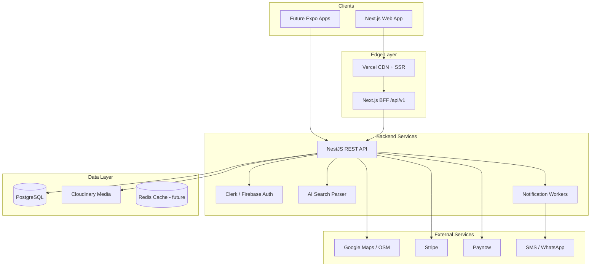
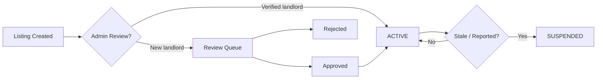

# HouseLink Zimbabwe Architecture

## Product Direction

HouseLink Zimbabwe is a website-first property marketplace designed to become
Android and iOS apps without changing the core backend. The public web app,
landlord dashboard, estate agent dashboard, and admin dashboard should all
consume the same REST API.

## System Shape

- Frontend: Next.js, React, TypeScript, Tailwind CSS.
- Backend: NestJS REST API with module boundaries by domain.
- Database: PostgreSQL through Prisma ORM.
- Auth: Clerk or Firebase Auth adapter behind an internal identity service.
- Storage: Cloudinary for listing photos, videos, documents, and verification
  media.
- Maps: OpenStreetMap/Leaflet by default, Google Maps adapter where needed.
- Payments: Stripe for cards, Paynow first for Zimbabwe payments, EcoCash as a
  future integration.
- Notifications: Email, SMS, WhatsApp, and future push notifications.

## Frontend Reuse Strategy

The website is organized around reusable domain objects, API DTOs, and
component boundaries. Future mobile apps should reuse:

- REST endpoint contracts.
- Validation rules.
- Auth/session model.
- Listing, search, verification, payment, and messaging workflows.
- Shared design tokens and content model.

React Native can reuse business logic from a future `packages/domain` package
while keeping web-specific rendering in `apps/web`.

## Recommended Monorepo Evolution

```text
apps/
  web/            Next.js public site and dashboards
  api/            NestJS REST API
  mobile/         Future Expo React Native app
packages/
  domain/         Shared types, validation, permissions, search DTOs
  ui/             Shared design tokens and primitives
  config/         ESLint, TypeScript, Tailwind presets
prisma/
  schema.prisma   Database source of truth
```

This workspace now includes the website at the repository root, a NestJS API
scaffold in `apps/api`, and shared domain contracts in `packages/domain`.

## Backend Modules

- `auth`: token verification, roles, sessions, account linking.
- `users`: profiles, documents, preferences, favourites.
- `listings`: property CRUD, media, availability, duplicate checks.
- `search`: structured filters, AI query parsing, saved searches.
- `maps`: geocoding, nearby places, travel and CBD distance.
- `messaging`: enquiries, tenant-landlord chat, call/WhatsApp audit events.
- `verification`: identity, landlord, agent, and property verification.
- `reviews`: landlord, agent, property, and neighbourhood reviews.
- `payments`: subscriptions, featured listings, invoices, webhooks.
- `admin`: approvals, reports, analytics, CMS.
- `notifications`: email, SMS, WhatsApp, push-ready event delivery.

## API Principles

- API-first: every workflow must be available over authenticated REST.
- Version endpoints under `/api/v1`.
- Use cursor pagination for listing feeds and dashboards.
- Keep media uploads direct-to-Cloudinary through signed upload intents.
- Separate public listing data from private landlord/admin fields.
- Apply role-based access control at service boundaries, not only controllers.
- Store audit events for verification, reports, payments, and contact actions.

## Trust And Safety

Fake and stale listings are core product risks. HouseLink should prioritize:

- Phone, email, and identity verification.
- Landlord and estate agent verification badges.
- Property proof checks for high-risk listings.
- Automated stale listing reminders and expiry rules.
- Duplicate detection using title, location, price, media hashes, and contact.
- Report queues with admin review and user-facing transparency.

## Performance

- Use server-rendered public pages for SEO and fast first load.
- Keep initial homepage JavaScript light.
- Lazy load maps, video walkthroughs, dashboards, and chat.
- Optimize Cloudinary images with responsive sizes and modern formats.
- Cache public listing search results with short TTLs and invalidation events.
- Design for slow mobile networks with skeleton states and small payloads.

## High-Level System Diagram



## Request Flow (Listing Search)

1. User submits filters on `/search` or homepage hero.
2. Next.js server component or client fetches `GET /api/v1/listings?...`.
3. BFF validates query params, forwards to listing service.
4. Service queries PostgreSQL with indexed filters; returns cursor-paginated DTOs.
5. Response envelope includes `data` array and `meta.nextCursor`.
6. Client renders `ListingCard` components; map layer loads lazily.

## Authentication Flow

1. User signs in via Clerk/Firebase on `/auth`.
2. Client receives provider JWT; exchanges via `POST /api/v1/auth/session`.
3. Backend verifies token, upserts `User` record, returns HouseLink session context.
4. Protected routes check role (`LANDLORD`, `AGENT`, `ADMIN`) at service layer.
5. Mobile apps use the identical token exchange - no web-only cookies required.

## Media Upload Flow

1. Landlord requests `POST /listings/:id/media-intents` with `mediaType`.
2. API returns short-lived Cloudinary signed upload parameters.
3. Client uploads directly to Cloudinary (reduces server bandwidth).
4. Client confirms upload; API creates `ListingMedia` row with `publicId`.

## Trust Pipeline



## Deployment Topology

| Service | Host | Purpose |
| --- | --- | --- |
| Web app | Vercel | SSR, static assets, BFF routes |
| API | Railway / Docker | NestJS business logic |
| Database | Railway PostgreSQL | Primary data store |
| Media | Cloudinary | Images, video, documents |
| CI/CD | GitHub Actions | Lint, test, build, deploy |

## Mobile Reuse Contract

Future Android/iOS apps must consume only:

- `/api/v1/*` REST endpoints
- `packages/domain` TypeScript types (ported to Swift/Kotlin or shared via codegen)
- Cloudinary upload intents (same signed flow)
- Clerk/Firebase SDKs (same auth provider)

No business logic in Next.js page components - extract to `lib/` and `packages/domain`.
