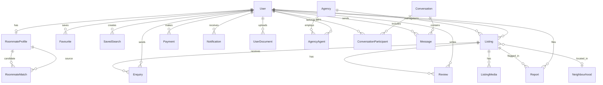

# Database Schema Design

HouseLink Zimbabwe uses PostgreSQL as the system of record. Prisma ORM (`prisma/schema.prisma`) is the single source of truth for models, relations, and migrations.

## Design Principles

- **Normalized core, denormalized reads where needed** - listing search fields live on `Listing` for fast filters; neighbourhood summaries are separate for reuse.
- **Trust by audit** - `AuditEvent` captures verification, payments, reports, and contact actions.
- **Mobile-ready** - every table maps to REST DTOs in `packages/domain`; no web-only fields in the database.
- **Zimbabwe-first** - USD default currency, amenity flags for solar, borehole, generator, water tank, and security features common in local markets.

## Entity Relationship Overview

## Core Models

### User

Central identity for seekers, landlords, agents, and admins. A user may hold multiple `Role` values.

| Field | Purpose |
| --- | --- |
| `roles` | `SEEKER`, `LANDLORD`, `AGENT`, `AGENCY_ADMIN`, `ADMIN` |
| `identityStatus` | National ID / passport verification state |
| `phoneVerifiedAt` | OTP-verified phone timestamp |
| `emailVerifiedAt` | Email confirmation timestamp |

### Listing

The primary marketplace entity. Supports rent and buy intents across six property types.

| Index | Columns | Use case |
| --- | --- | --- |
| Location | `city`, `suburb` | City/suburb browse |
| Discovery | `intent`, `propertyType`, `status` | Filtered feeds |
| Price | `price` | Budget sort and range |

**Amenity flags** (boolean columns for fast filtering):

- `wifi`, `solarBackup`, `borehole`, `generator`, `waterTank`
- `parking`, `securityWall`, `electricFence`, `garden`, `swimmingPool`
- `furnished`, `petFriendly`

**Lifecycle** (`ListingStatus`):

`DRAFT` -> `PENDING_REVIEW` -> `ACTIVE` -> `RENTED` / `SOLD` / `EXPIRED` / `SUSPENDED`

Stale listing policy: `expiresAt` triggers reminders; `ACTIVE` listings without engagement auto-move to `EXPIRED`.

### ListingMedia

Cloudinary-backed photos and video walkthroughs. `publicId` enables transforms; `sortOrder` controls gallery sequence.

### Trust And Safety

| Model | Role |
| --- | --- |
| `Report` | User-reported fake, duplicate, scam, or stale listings |
| `UserDocument` | Identity and ownership proof uploads |
| `AuditEvent` | Immutable action log for admin review |
| `Neighbourhood` | Aggregated area scores (safety, water, transport) |

### Roommate Matching

`RoommateProfile` stores preferences; `RoommateMatch` stores AI-generated compatibility scores and human-readable `reasons`.

### Messaging

`Conversation` groups participants around a listing (optional). `Message` stores chat body; `lastReadAt` on participants enables unread counts.

### Payments

`Payment` tracks featured listing upgrades and agency subscriptions via `STRIPE`, `PAYNOW`, or future `ECOCASH`.

### Notifications

`SavedSearch.query` stores JSON filter snapshot. `channels` array supports `EMAIL`, `SMS`, `WHATSAPP`, and future `PUSH`.

## Duplicate Detection Strategy

When a listing is created or updated, a background job compares:

1. Normalized title similarity (Levenshtein / trigram)
2. Same `ownerId` or phone hash
3. Geo proximity within 200 m
4. Price within 5%
5. Media perceptual hash overlap

Candidates are flagged in `AuditEvent` and surfaced in the admin review queue.

## Migration Strategy

1. `prisma migrate dev` for local development
2. `prisma migrate deploy` in CI/CD before app deploy
3. Seed script for Zimbabwe cities, suburbs, and demo listings (dev only)

## Future Extensions (No Breaking Changes)

- `Listing.comparisonGroupId` for side-by-side compare persistence
- `Agency.subscriptionTier` for plan limits
- `Listing.featuredUntil` for paid promotion windows
- PostGIS `geography` column for radius search (optional upgrade from lat/lng decimals)
