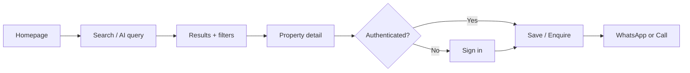
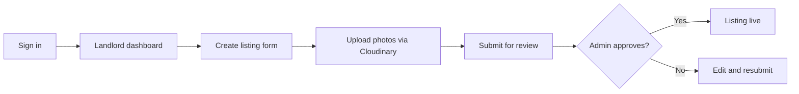

# UI/UX Wireframes

## Public Homepage

1. Sticky header with brand, rent, buy, sell, roommates, agents, sign in, and
   list property.
2. Large property-led hero with direct search controls.
3. Smart filter chips for Zimbabwe-specific needs such as solar, borehole,
   water tank, Wi-Fi, and security.
4. Trust strip explaining verification, AI search, instant contact, and alerts.
5. Category grid for rooms, houses, flats, cottages, commercial, land, and
   roommates.
6. Featured and latest listings with verification badges.
7. Popular city cards.
8. Map preview and nearby essentials.
9. Trust system section.
10. Footer with marketplace, trust, and company links.

## Search Results

- Left or top filter panel depending on viewport.
- Result cards with image, price, suburb, badges, availability, and key
  amenities.
- Map toggle on mobile, split list/map on desktop.
- Sort by newest, price, verified, and distance.
- Save search and alert CTA.

## Property Detail

- Photo gallery and video walkthrough.
- Price, address summary, availability, verified status.
- WhatsApp, call, save, share, and report actions.
- Amenities, description, nearby places, landlord/agent profile, reviews.
- Similar listings and neighbourhood notes.

## Landlord Dashboard

- Listing status overview.
- Create listing flow with media upload and verification prompts.
- Enquiries inbox and WhatsApp/call history.
- Analytics for views, saves, enquiries, and conversion.
- Upgrade listing and subscription options.

Current route: `/dashboard/landlord`

## Admin Dashboard

- Review queues for listings, reports, landlord verification, and agent
  verification.
- User management.
- Payment and revenue analytics.
- CMS controls for city pages, safety copy, and featured content.

Current route: `/dashboard/admin`

## Accessibility Notes

- Every form field needs visible labels.
- Search must work without a map.
- Buttons use icons only when labels or aria labels are present.
- Cards must keep text readable over images and support keyboard navigation.

## User Flows

### Seeker: Find and Contact



### Landlord: List Property



### Roommate Matching

1. User creates profile at `/roommates` (budget, lifestyle, locations).
2. `GET /roommates/matches` returns scored candidates.
3. User contacts compatible match via in-app message or WhatsApp.

## Screen Inventory

| Screen | Route | Priority |
| --- | --- | --- |
| Homepage | `/` | P0 |
| Search results | `/search` | P0 |
| Property detail | `/listings/[id]` | P0 |
| Auth | `/auth` | P0 |
| Saved / alerts | `/saved` | P1 |
| Compare | `/compare` | P1 |
| Roommates | `/roommates` | P1 |
| Messages | `/messages` | P2 |
| Payments | `/payments` | P2 |
| Landlord dashboard | `/dashboard/landlord` | P1 |
| Agency dashboard | `/dashboard/agency` | P2 |
| Admin dashboard | `/dashboard/admin` | P2 |

## Homepage Wireframe (Desktop)

```text
+------------------------------------------------------------------+
| [Logo]  Rent  Buy  Sell  Roommates  Agents     [Sign in] [List]  |
+------------------------------------------------------------------+
|                                                                  |
|   Find Your Next Home          [  Search bar + filters  ] [Go]   |
|   with Confidence.                                               |
|   [Solar] [Borehole] [Wi-Fi] [Parking] [Pets]                  |
|                                                                  |
+------------------------------------------------------------------+
|  Verified | AI Search | Instant Contact | Smart Alerts          |
+------------------------------------------------------------------+
|  [Room] [House] [Flat] [Cottage] [Commercial] [Land] [Roommate]  |
+------------------------------------------------------------------+
|  Featured Listings          |  Latest Listings                   |
|  [card] [card] [card]       |  [card] [card] [card]              |
+------------------------------------------------------------------+
|  Popular Cities: Harare | Bulawayo | Gweru | Mutare | Kwekwe    |
+------------------------------------------------------------------+
|  Why HouseLink | Testimonials | Map preview | Footer              |
+------------------------------------------------------------------+
```

## Property Detail Wireframe (Mobile)

```text
+---------------------------+
|  [<]  Share  Save  Report |
+---------------------------+
|                           |
|     [ Photo gallery ]     |
|                           |
+---------------------------+
| $450/mo  Verified         |
| 2 bed - Avondale, Harare  |
+---------------------------+
| [ WhatsApp ]  [ Call ]    |
+---------------------------+
| Amenities | Description   |
| Map | Nearby | Reviews    |
| Landlord profile          |
+---------------------------+
```

## Component Mapping

| Wireframe element | Component |
| --- | --- |
| Header | `components/layout/site-header.tsx` |
| Footer | `components/layout/site-footer.tsx` |
| Listing card | `components/listings/listing-card.tsx` |
| Dashboard stat | `components/dashboard/stat-card.tsx` |
| Button | `components/ui/button.tsx` |

See `docs/design-system.md` for tokens, colors, and motion guidelines.
